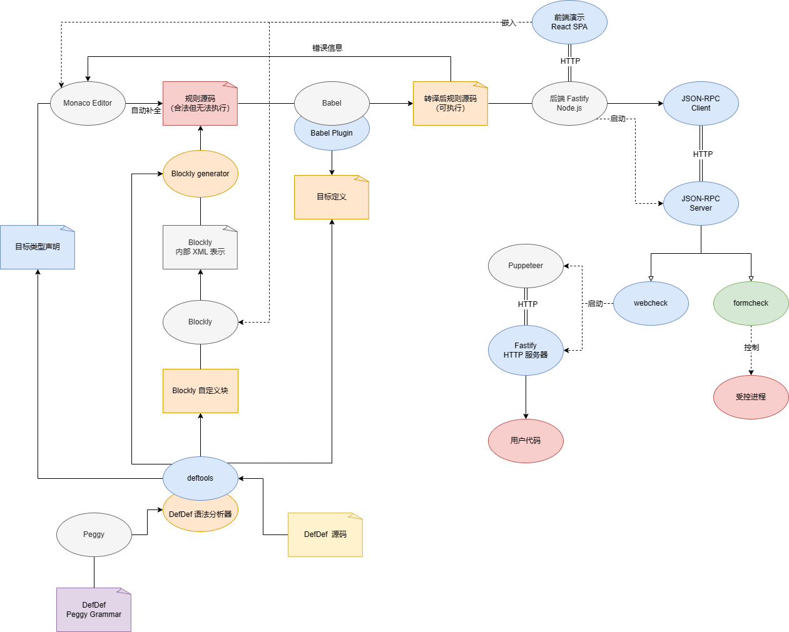

# 可视化 OJ 项目

一个完整的 OJ 需要有：

- 前端界面
- 后端服务器
    - 数据库
    - **判题系统**

重点先完成判题系统

## 判题系统分类

1. Web 前端
2. Windows Form（Qt、Tkinter）
3. 其它窗体（海龟、BGI）

### Web 端

目前总思路：利用 puppeteer

判题系统输入：
1. 用户代码（纯 HTML，或压缩文档含 `index.html`）
2. 规则（JavaScript 描述？）

流程：
1. 启动本地服务器，展示静态页面；
2. 启动 puppeteer，定位到对应的页面；
3. 根据规则控制 puppeteer。

#### 规则描述

分为两类：
1. 控制指令
2. 断言指令

一个简单的示例

用户代码：
```html
<!DOCTYPE html>
<title>Hello, world</title>
<h1>Hello, world!</h1>
```

规则：
```js
test("case 0", (page) => {
    expect(page).toHaveTitle("Hello, world");
    expect(page.locator("h1")).toEqual("Hello, world!");
});
```

### Windows Form

了解到 Windows 提供了自动测试相关的接口

#### 历史

1. MSAA (Microsoft Active Accessibility, Win 95)
2. Windows Automation API 2.0, UIA2 (C# (Managed))
3. Windows Automation API 3.0, UIA3 (C++ (COM))

C# 包装库 FlaUI

## 判题系统实现

- Web 端判题用 JS/TS，因为 puppeteer 是 JS API
- Windows Form 端判题用 C#，使用 FlaUI 轮子

### 2D 图形界面

如何判断两个 2D 图形界面的相似度？
- 逐像素比对（e2e 测试用的库）：完全不行，边缘差异无法忽视
- MSE/SSIM 等算法：未尝试，但是针对**照片**而非**图形**的算法效果不一定好
- 自研

#### 自研算法描述

1. 边缘检测（Canny）
2. （降采样）
3. 轮廓提取（对象列表）
4. 对对象位置关系：
  1. 根据整体相对位置编号（贪心）
  2. 计算相互距离矩阵
  3. 得出距离相关性（Mantel 测试）
5. 对每个对象：
  1. MSE/SSIM 求相似度
6. 对背景：
  1. 平均颜色差异
7. 上述三者加权平均

-----

## 关于重构

初版

```
                                   /--> puppeteer
规则描述-----------------> JSON --+--> FlaUI
          服务器解释执行           \--> ???

```

第一次重构

```
                                           /--> puppeteer
规则描述---------> AST ----------> JSON --+--> FlaUI
          分析器          转译器           \--> ???

```

第二次重构

```
                                                           /--> RPC Server <- puppeteer
规则描述---------> JavaScript -------------> RPC Client <-+--> RPC Server <- FlaUI
          转译器                 解释执行                  \--> ???
            ||                                       JSON-RPC on HTTP
            || Babel plugin
            ||
       Babel parser;
         traverse;
      Babel generator;
```

第三次重构


